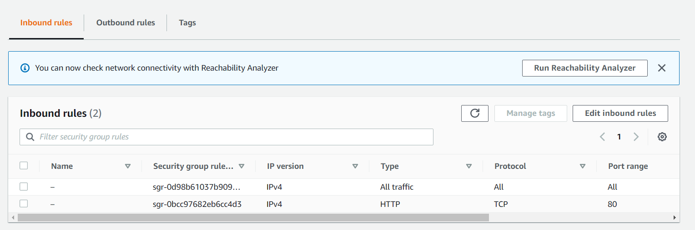
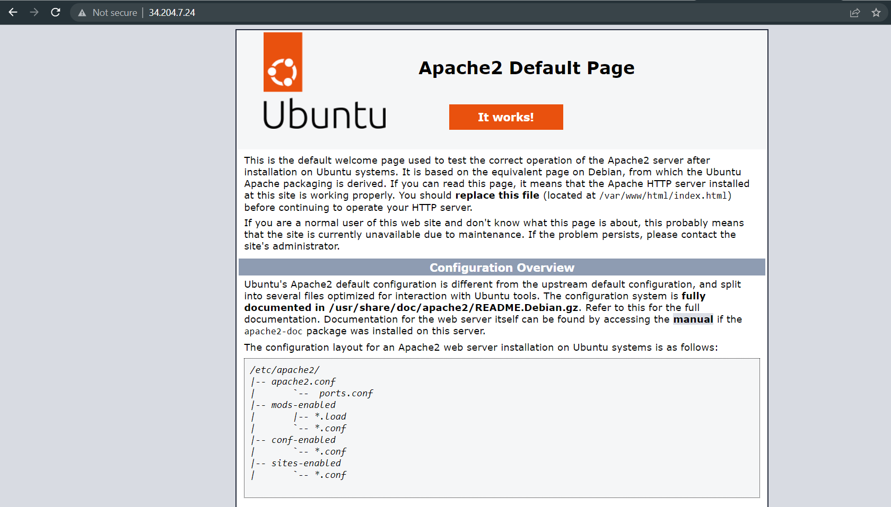
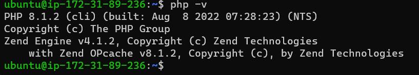
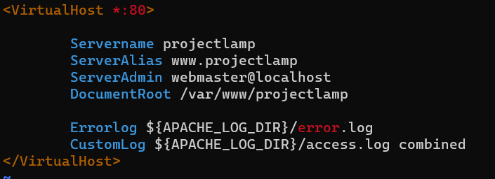
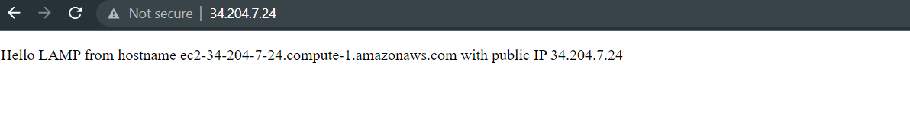
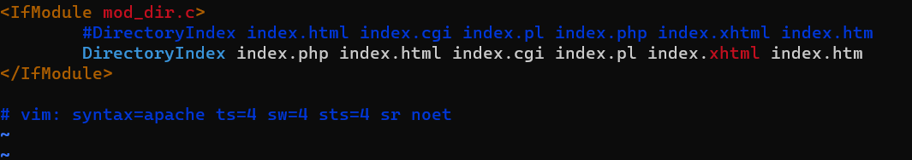
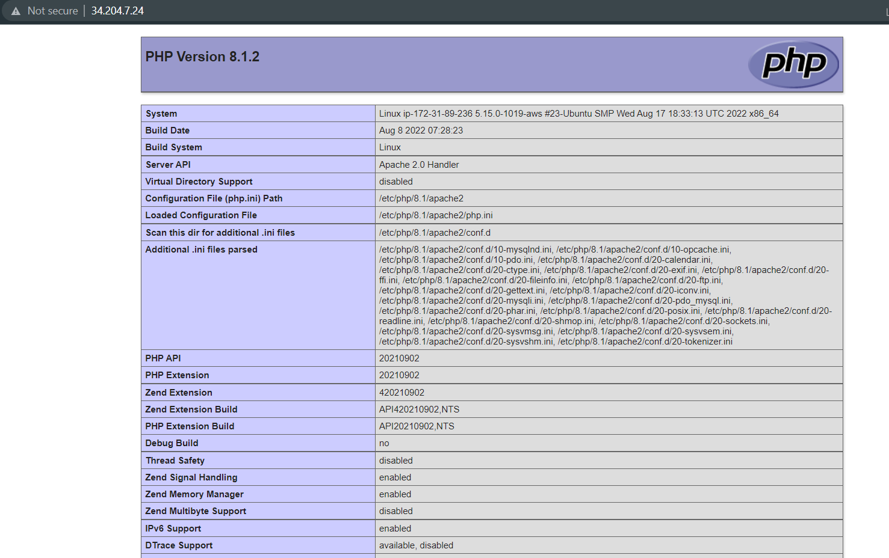

## Documentation of project 1; LAMP STACK (DevOps Engineer Path)
### Install apache and updateing the firewall
* sudo apt update && sudo apt upgrate
* sudo apt install apache2
* sudo systemclt status apache2

* Open TCP port 80 for web access from anywhere

* Test apache website http://34.204.7.24:80

## Install mysql
* sudo apt install mysql-server
* sudo mysql
* ALTER USER 'root' @'localhost' IDENTIFIED WITH mysql_native_password BY 'PassWord.1'
### Secure the database
* sudo mysql_secure_installation
### Test root password access
* sudo mysql -p
* mysql> exit

## Install PHP
* sudo apt install php libapache2-mod-php php-mysql
### Check php version
* php -v

## Creating a virtualhost for the website using apache
### Create site diretory 'projectlamp'
* sudo mkdir /var/www/projectlamp
### assign system user to own projectlamp directory
* chown -R $USER:USER /var/www/projectlamp
### Create a new configuration site for projectlamp 
* sudo vim /etc/apache2/sites-available/projetclamp.conf
### Create a virtualhost for the new site. Add the txt below

### use the **ls** command to list the files in **sites-available** directory
* sudo ls /etc/apache2/sites-available
### 000-default.conf default-ssl.conf projectlamp.conf
### enable projectlamp site
* sudo a2ensite projectlamp
### disable 000-default site'
* sudo a2dissite 000-default
### check to make sure there are not errors in apache config file
* sudo apachectl configtest
### Relaod apache config file
* sudo systemctl reload apache2
### Create an **index.html** file in website directory
* vim /var/www/projectlamp/index.html
### Test new website
* http://publick-Ip-Address:80

## Enable PHP on projectlamp website
### change the site order by editing **/etc/apache2/modes-enabled/dir.conf** by making sure index.php comes first in the order
* sudo vim /etc/apache2/mods-enabled/dir.conf

### reload apache to update the changes
* sudo systemctl relaod apache2
### Create an index.php file to replace insdex.html
* sudo vim /var/www/projectlamp/index.php
### Test php-page by refreshing the browser

### This page confirms PHP is loaded and working properly
### Delete the index.php page so the site can default toindex.html
### This completes our LAMP STACK project. PBL